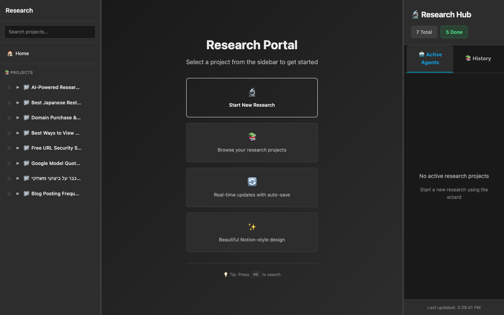

## Gallery

See the interface in action:


*The main research portal — browse your completed projects with real-time progress tracking*


*The research wizard — configure your research topic, AI provider, depth, and style*


*Full desktop interface with detailed project sidebar and research hub*

---

## Autonomous Research

**The core feature.** You describe what you need to know, and an AI agent figures out how to research it.

This isn't a prompt-response chatbot. The agent:
- Plans its own search strategy
- Executes multiple searches across different angles
- Reads and cross-references sources
- Decides when it has enough information
- Writes and organizes the final report

You can watch all of this happen in real-time, or check back when it's done.

### Research Depth Options

- **Quick** — Fast overview, 5-10 minutes, good for simple questions
- **Standard** — Thorough research, 15-30 minutes, covers multiple perspectives  
- **Deep** — Comprehensive analysis, 30+ minutes, extensive source review

### Output Styles

- **Comprehensive** — Everything the agent found, well-organized
- **Comparing** — Side-by-side analysis when evaluating options
- **Practical** — Focus on actionable takeaways and recommendations

---

## Private Web Search

Research Portal bundles [SearXNG](https://github.com/searxng/searxng), a self-hosted metasearch engine.

**What this means:**
- Your search queries never hit Google/Bing servers directly
- No tracking, no personalization bubbles
- Aggregates results from multiple engines for better coverage
- Runs entirely on your machine

**Included search engines:**
- Google, Bing, DuckDuckGo (general)
- Wikipedia (reference)
- GitHub, Stack Overflow (code)
- Configurable: add arXiv, Reddit, etc.

---

## Your Choice of AI

Use whatever LLM you're already paying for.

| Provider | Best For | Models |
|----------|----------|--------|
| **Anthropic** | Nuanced research, complex topics | Claude Sonnet, Opus |
| **OpenAI** | General research, coding topics | GPT-4o, GPT-4 |
| **Google** | Fast iterations | Gemini Pro |

Switch providers per-project if you want. The agent adapts.

---

## Real-Time Visibility

See exactly what's happening as research progresses:

- **Current task** — What the agent is working on right now
- **Progress bar** — Estimated completion percentage
- **Activity log** — Every search, every source read, every decision
- **Tool calls** — Expand to see search queries and results

No black box. If the agent goes off-track, you'll see it immediately.

---

## Local-First Storage

Research outputs are plain files on your filesystem:

```
~/research/
├── keyboard-comparison-2024/
│   ├── metadata.json      # Title, tags, category
│   ├── README.md          # Executive summary
│   ├── findings.html      # Detailed report
│   └── sources.md         # References
```

**Benefits:**
- Version control with git
- Backup however you want
- Edit with any text editor
- Survives if you uninstall the app
- No database lock-in

---

## Browse and Organize

The web interface isn't just for starting research. It's a reader for your research library.

- **Project browser** — All your research, organized
- **Search** — Find across all projects
- **Favorites** — Quick access to important docs
- **Drag-and-drop** — Reorder projects your way
- **Keyboard shortcuts** — `Cmd+K` for quick navigation

---

## MCP Integration

Connect your research library to AI assistants that support the [Model Context Protocol](https://modelcontextprotocol.io/).

**Claude Desktop:** Add Research Portal as an MCP server, and Claude can search and read your research library directly.

**OpenCode:** Same deal — your coding assistant can reference past research.

**Custom clients:** The MCP endpoint is standard JSON-RPC. Build your own integration.

See [MCP Integration](/online-research/guides/mcp-integration/) for setup.

---

## What's Not Included

Being honest about limitations:

- **No team features** — Single-user, local-first
- **No cloud sync** — Your machine, your files
- **No mobile app** — Web UI only
- **No PDF export** — Markdown/HTML output (for now)

This is a power-user tool for people who want control over their research workflow. If you need collaboration features, you'll need to add them yourself or wait for future versions.
